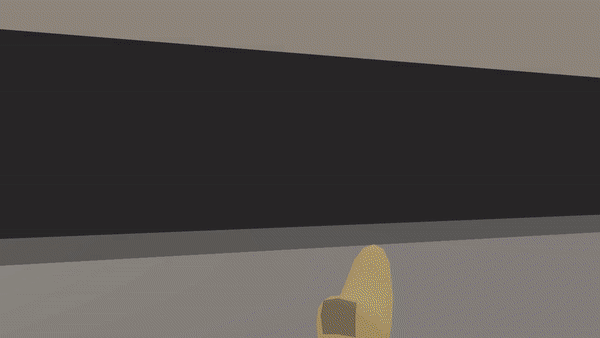
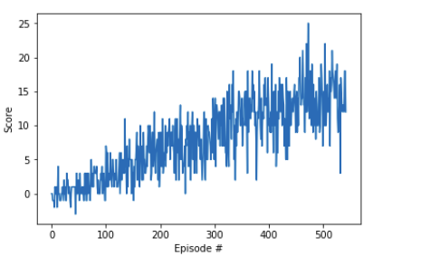
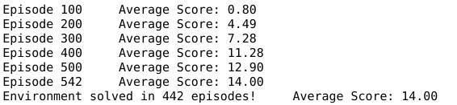
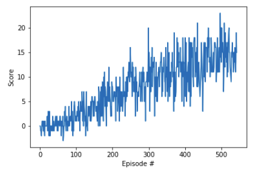
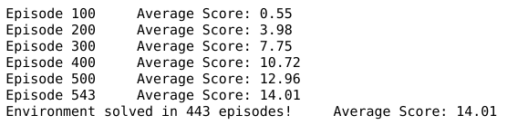
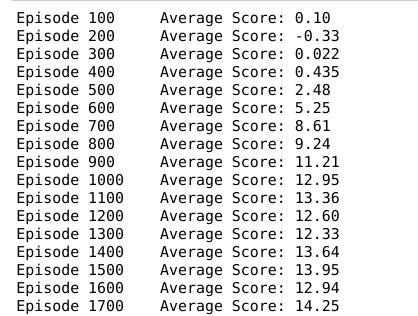
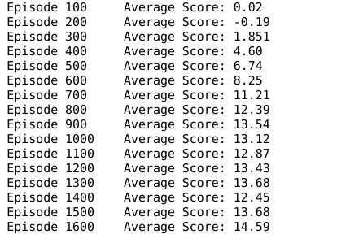
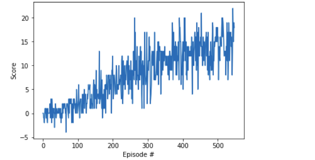
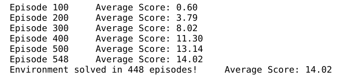
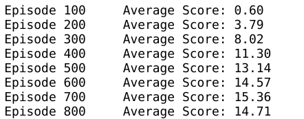

# Navigation Project

Note : Reward was capped at 14 for all algorithms, 

Here is what the trained agent looks like (Duelling Double DQN) : 

## 1) Baseline : Vanilla DQN

| Reward Progression                    |                                       |
| ------------------------------------- | ------------------------------------- |
|  |  |

DQN Architecture: 2x Fc (64 units) with Relu activation 

## 2) Double DQN

| Reward Progression               |                                          |
| -------------------------------- | ---------------------------------------- |
|  |  |

| DQN without soft update         | Double DQN without soft update     |
| ------------------------------- | ---------------------------------- |
|  |  |

DQN Architecture: Same as Vanilla DQN

**<u>What's different</u>**? : The action chosen for target fixed Q value and the evaluation of Q-Values for that action are done **<u>separately</u>** by the Local and Target network , unlike in vanilla DQN where only the Target Net is used.

We can see that in the initial stages of training, Double DQN is more stable and gradual unlike Vanilla DQN.

The difference is hardly appreciable. But, if we take $\tau​$ =1 and perform hard update on target network every 10 episodes, ie; disabling soft-update, the performance difference is noticeable. Double DQN reaches +14 average reward first, about 100 epsiodes before DQN. 

**<u>In my opinion</u>**, Soft updating takes away the effect of Double DQN in case of this environment. [ I don't know why though. or maybe DQN itself if better of than Double DQN for this particular environement]

**<u>Further study</u>** can  be done to check the effect of Double DQN on custom or much more environments. Maybe it has more effect in more complex environments.

## 3)Dueling DQN

| Reward Progression                  |                                   |
| ----------------------------------- | --------------------------------- |
|  |  |

DQN Architecture: FC(64) $\rarr$FC(32) $\rarr$FC_value ( 64) + FC_Advantage(64) $\rarr$output. All having Relu activation

**<u>What's Different?</u>** Duelling DQN adress the problem associated with DQNs wherein certain actions taken in a state don't really effect the overall outcome, or the long term reward. For example, if the agent is in an space surrounded by yellow bananas, It doesn't really matter which direction it goes, and thus, it makes sense to decouple the Action value computation from the action selection since, it is not required to compute the action value of each and every state. Duelling DQNs are different from DQNs in that, after a general neural architecture, the network branches into 2, one which calculates the value function V and another which calculates the Advantage of taking an action at the state. Aggregation of these two separate layers, then gives the final output.

Surprisingly, Duelling Double DQNs perform similar to Vanilla DQN in terms of speed. Maybe the environment is simple enough that Vanilla DQN is the best choice. 

**<u>Future Study</u>** Although my repository does have code for Prioritized Experience Replay, i wasn't able to completely implement it. Prioritized ER is obviously the next step for implementation although I am skeptical about its performance since DDDQN and DQN both solve the environment quick enough, well within 500 epsiodes. 

Probably Duelling, Double and PER will be beneficial in the case of the optional Excercise, ie; using the Camera Pixels data as input state information. 

Accordingly, the future scope is to implement PER on this enviroment and All three improvements in for the optional excercise. Another potential improvement coould be tweaking the hyperparamters more for faster training.

(FInal image, for maintaining 13+ reward for 100+ epsiodes)